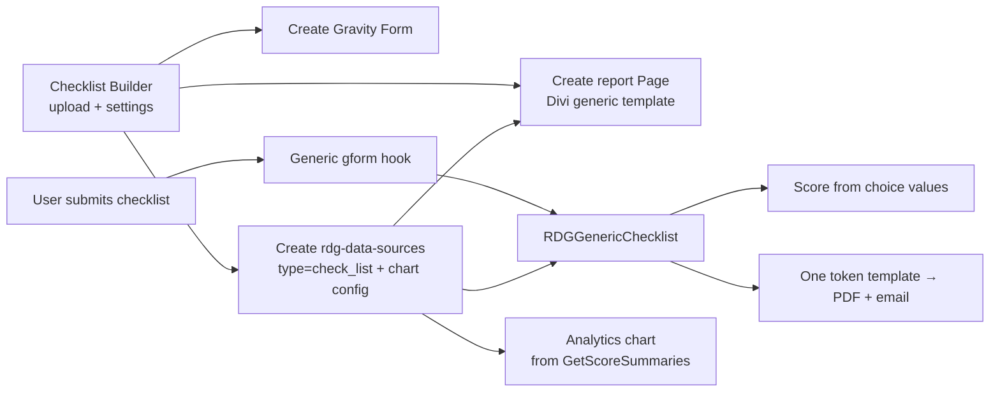
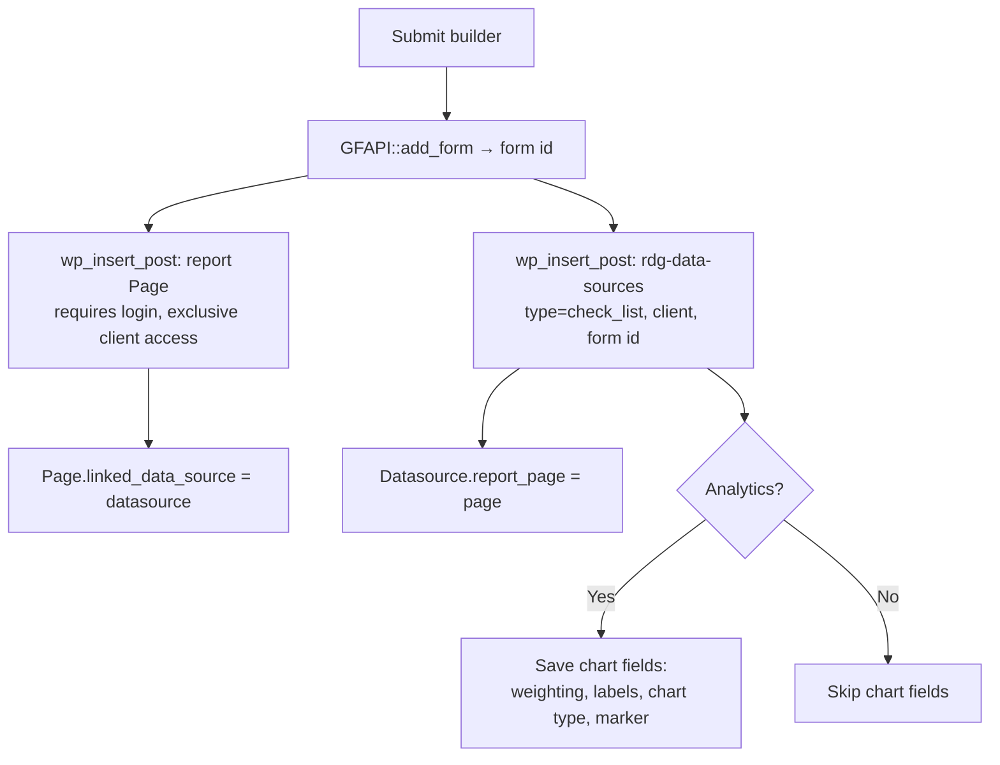

# REX Dynamic Checklist Form Builder — Technical Specification

**Status:** Draft for review
**Author:** Retail Doctor Group
**Last updated:** 2026-07-23

---

## 1. Purpose

Today, onboarding a new client checklist is a manual developer task: build the Gravity Form by hand, write a client PHP class, write a report template, and wire it into `vantage-it.php`. As RDG onboards more clients, this does not scale.

This document specifies **Phase 1: the Excel → Gravity Form generator** — an admin uploads a spreadsheet plus a few settings, and the system creates the Gravity Form automatically via `GFAPI::add_form()`.

> **Scope note:** This spec covers *creating the form* — **now implemented** (see §11). The *processing* side (scoring, PDF, email, report page) is the next phase. The scoring is designed to work from the radio choice values defined here, so no per-client scoring code is needed.

---

## 2. Excel file format

The admin-supplied spreadsheet is **Type-driven**: fixed columns A–F, then the columns *after* `Type` hold that type's choices and marks.

### Fixed columns

| Col | Header | Meaning | Maps to |
|-----|--------|---------|---------|
| A | **Ref** | Display order (informational) | Field order |
| B | **Category** | Groups items; each category = one page | Page title |
| C | **Checklist Item** | The question / instruction | Field **label** (or read-only text for `None`) |
| — | **How to check** *(optional)* | Extra guidance for the item; may be blank or absent, and can appear on any row | Field **description** |
| D | **Image Y/N** | `Y` = add an **optional** file upload after the item | `fileupload` |
| E | **Comment** | `Y` = add an **optional** "Comments" text box | `textarea` |
| F | **Type** | Decides the field type (see §2.1) | field type |
| G… | *(no header)* | Choices + marks for that Type | choice `value` encoding |

> **Columns are matched by header name** (not fixed position), so an optional **How to check** column is handled wherever it appears — present or absent, filled or blank. When filled, its text becomes the field's description; for a `None` item it is shown as extra read-only text.

### 2.1 Type column → field built

| Type | Trailing columns | GF field | Style | Scored |
|------|------------------|----------|-------|--------|
| `Yes No` | `Yes, mark, No, mark` | `radio` (2) | `yes-no-toggle` (buttons) | Yes |
| `True False` | `True, mark, False, mark` | `radio` (2) | `yes-no-toggle` (buttons) | Yes |
| `Radio Buttons` | `Label, mark` repeated (2+) | `radio` | normal radio | Yes |
| `Manual Score` | `Maximum, N` | `number` (0–N) | — | Yes |
| `Short Text` | *(none)* | `text` | — | No |
| `None` | *(none)* | read-only text (no answer field) | — | No |

Marks live **next to each choice** and vary per row. The builder reads label/mark pairs across the trailing columns, so 2, 3 or more options are handled automatically.

> **`Yes No` vs `True False` vs `Radio Buttons`:** all three are single-choice radios — the difference is **cosmetic only**. `Yes No` and `True False` render as large tap-friendly **buttons** (`yes-no-toggle`); `Radio Buttons` renders as standard radio circles. Same scoring behaviour for all.

### Sample (new format)

| Ref | Category | Checklist Item | Image | Comment | Type | Choices / marks |
|-----|----------|----------------|-------|---------|------|-----------------|
| 1 | Supplier & Purchasing | Undertake a deep dive in the supplier sales… | N | Y | Radio Buttons | Complete 10, Incomplete 0, In Progress 5 |
| 2 | Supplier & Purchasing | Introduce preferred supplier to replace non-preferred products | N | N | None | — |
| 3 | Supplier & Purchasing | What range/s are missing in their store? | N | Y | Manual Score | Maximum 5 |
| 7 | Product & Merchandising | Implement product rationalisation… | N | Y | Yes No | Yes 5, No 0 |
| 10 | Systems & Support | Ensure stores signed up to Intranet, HR central… | N | Y | Short Text | — |
| 17 | Supplier & Purchasing | Follow up product or supplier issues… | N | N | Yes No | Yes 5, No 0 |

> **Note:** `Category` values repeat non-contiguously (e.g. `Supplier & Purchasing` at Ref 1–5 **and** Ref 17). See §5.1 — rows are **grouped by category** so each category is a single page.

---

## 3. Admin UI — what the admin enters

The admin (RDG only) enters **just two things**:

1. **Checklist name** (e.g. `Demo Store Compliance`)
2. **Excel file**

Everything else is **generated automatically** from the checklist name — the admin never touches HTML or CSS.

### Auto-generated from the checklist name

Let `slug = sanitize_title(name)` (e.g. `Demo Store Compliance` → `demo-store-compliance`).

| Setting | Gravity Forms property | Rule | Example |
|---------|------------------------|------|---------|
| Form title | `form.title` | = name as typed | `Demo Store Compliance` |
| CSS Class Name | `form.cssClass` | `slug + "-checklist"` | `demo-store-compliance-checklist` |
| Required indicator | `form.requiredIndicator` | fixed | `asterisk` |
| Require login | `form.requireLogin` | fixed | `true` (always) |
| Login message (HTML) | `form.requireLoginMessage` | auto-built (see below) | — |
| Animated transitions | `form.enableAnimation` | fixed | `true` (On) |
| Spam honeypot | `form.enableHoneypot` | fixed | `true` |
| Honeypot action | `form.honeypotAction` | fixed | `abort` (do **not** create an entry) |
| Default confirmation | confirmation message | auto-built (see below) | — |

### Auto-built login message

The redirect URL is derived from the current site + `slug + "-checklist"` (so it works per client / environment — no hardcoded domain):

```html
<div class="alert bg-info-subtle border border-1 border-info m-5 p-5 rounded-3">
  Please <a href="{site}/wp-login.php?itsec-hb-token=panel&redirect_to={urlencode(site + '/' + slug + '-checklist/')}">log in</a> to fill this checklist.
</div>
```

For `Demo Store Compliance` on `demo.rdgrx.com.au` this produces the redirect `…/demo-store-compliance-checklist/`.

### Auto-built confirmation message

> Thank you for filling out the "**{Checklist name}**". To download the report, use the View Report button on the Dashboard.

### Additional builder behaviours

- **RDG admin only** (`manage_options`); nonce-protected submission.
- **Duplicate-name validation:** if a Gravity Form with the same title already exists (active or inactive), creation is rejected — no duplicate form is made.
- **Upload:** `.xlsx` / `.xls` (via SimpleXLSX) or `.csv`, max 5 MB.
- **Per-item image field:** optional, **max 5 MB**, images only (`jpg,jpeg,png,gif`).
- **Store Owner Name visibility:** a checkbox lets the admin keep *Store Owner Name* hidden (default) or show it as a **visible, required** field. Company Name stays hidden.
- **Breadcrumb:** *Dashboard › Checklist Builder* at the top of the screen.

---

## 4. Fixed first page — "Store details"

This page is **always generated identically**, before any Excel content. It is NOT taken from the spreadsheet.

**Page 1 title:** `Store details`

| Field | GF Type | Settings |
|-------|---------|----------|
| Store | `select` | `cssClass = 'populate-locations'`, **required**. Populated at render time by the existing `gform_pre_render` store-dropdown hook. |
| Store Owner Name | `hidden` **or** visible | Default **hidden, not required**. A builder checkbox ("Ask for Store Owner Name on the form") instead makes it a **visible, required** text field. |
| Company Name | `hidden` | **Not required.** Placeholder for now. |

A **page break** follows this page. The **first Excel category begins on Page 2**.

---

## 5. Excel content → form structure

### 5.1 Paging rule (group by category — Option A)
- Rows are **grouped by `Category`**. All rows sharing a category go on **one page**, ordered by the category's **first appearance** in the sheet.
- Because categories repeat non-contiguously (e.g. Ref 17 is `Supplier & Purchasing` again), grouping means Ref 17 joins Ref 1–5 on the same page. This reorders items but avoids duplicate category pages.
- **Page title = Category name.** The first category is **Page 2** (Page 1 is the fixed "Store details").

### 5.2 Per-row field mapping

Each row builds a **main field** based on `Type`, plus (optionally) a file upload and a comments box.

#### Main field by Type

**`Yes No`** — radio, `cssClass = yes-no-toggle`, required

| Choice | value |
|--------|-------|
| Yes | `yes-{mark}` (e.g. `yes-5`) |
| No | `no-{mark}` (e.g. `no-0`) |

**`True False`** — identical to `Yes No` (button styling, `yes-no-toggle`, required). Values `true-{mark}` / `false-{mark}`.

**`Radio Buttons`** — radio, **normal styling**, required. One choice per label/mark pair:

| Choice | value |
|--------|-------|
| Complete | `complete-10` |
| Incomplete | `incomplete-0` |
| In Progress | `in-progress-5` |

> Value = `slug(label) + "-" + mark`. The scoring engine reads the number **after the last dash** as the score. Works for any number of options.

**`Manual Score`** — `number` field, required
- `min = 0`, `max = Maximum` (whole numbers). The number entered **is** the score.

**`Short Text`** — `text` field, optional. Unscored.

**`None`** — read-only text only (GF `html` block showing the Checklist Item). No answer field, unscored.

#### Optional extras (any Type)
- **`Image = Y`** → `fileupload` after the item, **label removed**, **optional** (not required).
- **`Comment = Y`** → `textarea` labelled "Comments", optional.

### 5.3 Scoring model
- Item **max** = highest mark among its choices (`Yes No` / `Radio Buttons`) or `Maximum` (`Manual Score`).
- Item **earned** = mark of the selected choice, or the number typed.
- `Short Text` / `None` are excluded from totals.
- Report % = Σ earned ÷ Σ max.

---

## 6. Worked example — grouped by category

Using the new sample sheet (grouped by category, Option A), the pages are:

```
PAGE 1 — "Store details"
   • Store              (select, populate-locations, required)
   • Store Owner Name   (hidden, not required)
   • Company Name       (hidden, not required)
--- page break ---
PAGE 2 — "Supplier & Purchasing"        (Ref 1–5 + Ref 17 grouped here)
   1  Radio Buttons (Complete 10 / Incomplete 0 / In Progress 5)   + Comments
   2  None (read-only text)
   3  Manual Score (0–5)                                           + Comments
   4  Manual Score (0–5)                                           + Comments
   5  Radio Buttons (Complete 5 / Incomplete 0 / In Progress 2)
   17 Yes No (Yes 5 / No 0)
--- page break ---
PAGE 3 — "Product & Merchandising"      (Ref 6–7)
   6  Radio Buttons (Complete 5 / Incomplete 0 / In Progress 2)   + Image + Comments
   7  Yes No (Yes 5 / No 0)                                       + Comments
--- page break ---
… one page per remaining category (Showroom & Brand Standards, Systems & Support,
   Marketing & Comms, Visit Actions & Follow-Up, Customer Experience & After-Sales,
   Store & Business Operations, Product Care) …
```

---

## 7. Gravity Forms field structure (JSON produced per element)

The builder assembles a `$form` array and calls `GFAPI::add_form($form)`. Illustrative shapes:

### Form envelope
```json
{
  "title": "Floorworld Store Audit Checklist",
  "requiredIndicator": "asterisk",
  "requireLogin": true,
  "requireLoginMessage": "<div class=\"alert bg-info-subtle …\">Please log in…</div>",
  "cssClass": "floorworld-store-audit-checklist",
  "fields": [ /* see below */ ],
  "pagination": { "type": "percentage" }
}
```

### Store dropdown (page 1)
```json
{
  "type": "select",
  "label": "Store",
  "cssClass": "populate-locations",
  "isRequired": true,
  "choices": []
}
```

### Hidden fields (page 1)
```json
{ "type": "hidden", "label": "Store Owner Name" }
{ "type": "hidden", "label": "Company Name" }
```

### Page break
```json
{ "type": "page" }
```
> The page **title** (e.g. "Store details", "Visual Merchandising") is set via the page field's `nextButton`/`cssClass` conventions or a Section field at the top of each page, depending on the chosen GF rendering approach.

### Radio question — `Yes No` type
```json
{
  "type": "radio",
  "label": "Implement product rationalisation and/or updates initiated by the PMC",
  "cssClass": "yes-no-toggle",
  "isRequired": true,
  "choices": [
    { "text": "Yes", "value": "yes-5" },
    { "text": "No",  "value": "no-0" }
  ]
}
```

### Radio question — `Radio Buttons` type (multi-option, normal styling)
```json
{
  "type": "radio",
  "label": "Undertake a deep dive in the supplier sales…",
  "isRequired": true,
  "choices": [
    { "text": "Complete",    "value": "complete-10" },
    { "text": "Incomplete",  "value": "incomplete-0" },
    { "text": "In Progress", "value": "in-progress-5" }
  ]
}
```

### Manual Score — `number` (0–Maximum)
```json
{
  "type": "number",
  "label": "What range/s are missing in their store?",
  "isRequired": true,
  "rangeMin": 0,
  "rangeMax": 5
}
```

### Short Text — `text` (optional, unscored)
```json
{
  "type": "text",
  "label": "What cleaning products do you use for your hard / resilient flooring",
  "isRequired": false
}
```

### None — read-only text (`html`)
```json
{
  "type": "html",
  "label": "",
  "content": "<p>Introduce preferred supplier to replace non preferred products</p>"
}
```

### Optional file upload (Image = Y, label removed, optional)
```json
{
  "type": "fileupload",
  "label": "",
  "labelPlacement": "hidden_label",
  "isRequired": false
}
```

### Optional comments (Comment = Y)
```json
{
  "type": "textarea",
  "label": "Comments",
  "isRequired": false
}
```

> **Note:** Gravity Forms assigns numeric field IDs on save. After `GFAPI::add_form()` returns, re-read the form to capture the ID → question map, and store it (e.g. against the datasource record) for the processing phase.

---

## 8. Build algorithm (pseudocode)

```
read settings (checklist name)          # css class, login msg, confirmation auto-generated
read spreadsheet rows

fields = []

# --- Fixed page 1 ---
fields += SectionTitle("Store details")
fields += Select("Store", cssClass="populate-locations", required=true)
fields += Hidden("Store Owner Name", required=false)
fields += Hidden("Company Name",     required=false)

# --- Group rows by category (Option A), ordered by first appearance ---
categories = ordered unique row.Category
foreach category in categories:
    fields += PageBreak()
    fields += SectionTitle(category)

    foreach row where row.Category == category:
        switch row.Type:
            case "Yes No":
                choices = [ {Yes, "yes-" + yesMark}, {No, "no-" + noMark} ]
                fields += Radio(row.Item, cssClass="yes-no-toggle", required=true, choices)
            case "True False":
                choices = [ {True, "true-" + trueMark}, {False, "false-" + falseMark} ]
                fields += Radio(row.Item, cssClass="yes-no-toggle", required=true, choices)
            case "Radio Buttons":
                choices = for each (label, mark) pair: { label, slug(label)+"-"+mark }
                fields += Radio(row.Item, required=true, choices)      # normal styling
            case "Manual Score":
                fields += Number(row.Item, required=true, min=0, max=Maximum)
            case "Short Text":
                fields += Text(row.Item, required=false)
            case "None":
                fields += HtmlBlock(row.Item)                          # read-only text

        if row.Image == "Y":
            fields += FileUpload(label="", required=false)             # optional
        if row.Comment == "Y":
            fields += Textarea(label="Comments", required=false)

form = FormEnvelope(GetAutoFormSettings(name), fields)
form_id = GFAPI::add_form(form)
reload form -> capture field IDs -> save question map
```

---

## 9. Confirmed decisions

| # | Decision | Value |
|---|----------|-------|
| 1 | Field type source | `Type` column (Yes No / True False / Radio Buttons / Manual Score / Short Text / None) |
| 2 | Marks source | Per-choice, in columns after `Type` (varies per row) |
| 3 | Choice value encoding | `slug(label) + "-" + mark` (e.g. `complete-10`, `yes-5`); score = number after last dash |
| 4 | `Yes No` / `True False` styling | `yes-no-toggle` (buttons — mobile-friendly); cosmetic only |
| 5 | `Radio Buttons` styling | Normal radio (any option count) |
| 6 | `Manual Score` | `number`, min 0, max = `Maximum` (whole numbers) |
| 7 | `Short Text` | `text`, optional, unscored |
| 8 | `None` | Read-only text only (no answer field), unscored |
| 9 | Scored fields required | Yes (asterisk) |
| 10 | Image = Y | Optional file upload, label removed |
| 11 | Comment = Y | Optional "Comments" textarea |
| 12 | Paging | Group by Category (Option A); first category = Page 2 |
| 13 | Page 1 | "Store details": Store (required) + 2 hidden (not required) |
| 14 | CSS class | Auto: `slug(name) + "-checklist"` |
| 15 | Require login | Always true |
| 16 | Login message | Auto HTML, redirect from site + `slug + "-checklist"` |
| 17 | Required indicator | `asterisk` |
| 18 | Animated transitions | On |
| 19 | Honeypot spam action | `abort` (do not create entry) |
| 20 | Default confirmation | `Thank you for filling out the "{name}". To download the report, use the View Report button on the Dashboard.` |
| 21 | Duplicate name | Rejected if a Gravity Form with the same title exists (active or inactive) |
| 22 | Image field limits | Optional, max 5 MB, images only (`jpg,jpeg,png,gif`) |
| 23 | Field visibility | Inputs `visible`; page-1 hidden fields `hidden` |
| 24 | Access | RDG admin only (`manage_options`), nonce-protected |
| 25 | How to check (optional) | Optional per-row description; shown as field description or extra read-only text for `None` items |
| 26 | Store Owner Name visibility | Hidden by default; builder checkbox makes it visible + required (Company Name stays hidden) |

---

## 10. Open items / next phase

- **Store Owner Name / Company Name** — decide whether these are auto-populated from the selected store's `rdg-location` record, or remain blank placeholders.
- **File upload constraints** — ✅ done: each image field caps at 5 MB and accepts `jpg,jpeg,png,gif`.
- **Processing phase** — a generic engine that reads the `slug(label)-mark` values (score = number after the last dash) to score submissions, generate the PDF/email, and drive the report page (removes the need for a per-client PHP class).
- **Datasource auto-creation** — after form creation, auto-create/link the `rdg-data-sources` record (form ID, report page, SMTP key, transient prefix) so the checklist is wired up with no code.

---

## 11. Implementation status

**Built — the form generator:**
- Class: `classes/rdg-checklist-builder.php` (`VantageIt\RDGChecklistBuilder`).
- Shortcode: `[checklist-builder-admin]` (registered in `vantage-it.php`), placed on a page and reached via a Quick Link. **RDG admin only** (`manage_options`).
- Input: Checklist name + spreadsheet (`.xlsx`/`.xls` via SimpleXLSX, or `.csv`), max 5 MB.
- Security: nonce + capability check; inputs sanitised; output escaped; graceful errors.
- **Duplicate-name validation** against existing Gravity Form titles (active + inactive).
- Header auto-detected (falls back to A–F); rows grouped by category; fields per `Type`; choice values `slug(label)-mark`.
- **Optional 'How to check' column** (present/absent, filled/blank, flexible position) — text becomes field description or extra read-only text for `None` items.
- Field visibility explicit (inputs `visible`; page-1 Store Owner/Company `hidden`).
- Image fields optional, 5 MB max, images only.
- Creates the form via `GFAPI::add_form()`.

**Not yet built — next phase:**
- Processing engine (scoring → PDF / email / report page).
- Datasource auto-creation and store-owner/company auto-population.

---

## 12. Consolidation plan — one class, one template, one report page

Today every client checklist is onboarded with **its own PHP class, HTML template and Divi report page**. This section explains *why*, and the plan to replace all of it with a **single, data-driven engine** so an uploaded checklist works end-to-end with no per-client code.

### 12.1 Why there is a file & template per client today

**A. One PHP class per client** — `RDGDemo`, `RDGGme`, `RDGBarbequesGalore`, `RDGIndepet`, `RDGFloorworld`, each implementing `RDGClientInterface`. The contract is shared, but each implementation **hardcodes**:

| Hardcoded per client | Example |
|---|---|
| Field-ID → question/score map | `RDGFloorworld::GetQuestionMap()` |
| Report template path | `demo_compliance_checklist_report_template.html` |
| Logo + email subject | demo-logo.jpg, `Demo Checklist #…` |
| SMTP key constant | `SMTP2GO_DEMO_CHECKLIST_APIKEY` |
| Monthly analytics rollup | each `GetScoreSummaries()` |

**B. One HTML template per client** — same Bootstrap skeleton; differs only in **branding** (logo, title, colours) and the **fixed question list** → duplicated.

**C. One Divi report page per client** (`page-template-*-checklist-report.php`) — the on-screen "View Report" page. The dashboard "Checklists" tile links to a Page whose `rdg_page_linked_data_source` points at the datasource → duplicated for branding.

**D. Analytics is already datasource-driven** — the chart is *not* hardcoded: `RDGDataSources` reads the chart ACF fields and calls the client class's `GetScoreSummaries()` to build the monthly `actual / max / percent` series.

### 12.2 Why it no longer needs to be per-client

1. The builder **bakes the score into each choice value** (`complete-10`, `yes-5`), so a **generic** engine can score any form from its own definition — no `GetQuestionMap()`.
2. The **datasource ACF already stores every per-client setting** (SMTP key, transient prefix, report page, chart config, friendly name). The classes only hardcode them for historical reasons.

### 12.3 Target architecture — one of everything

| Today (per client) | Target (single, data-driven) |
|---|---|
| `RDGDemo`, `RDGGme`, … | one `RDGGenericChecklist` |
| `*_report_template.html` | one `generic_checklist_report_template.html` (token-based) |
| `page-template-*-report.php` | one `page-template-generic-checklist-report.php` |
| `SMTP2GO_*_CHECKLIST_APIKEY` | `rdg_datasource_smtp2go_api_key` |
| `case 10/13` + `gform_pre_render_N` | generic hooks (is this form a checklist? → run engine) |



### 12.4 Builder auto-wiring (what the builder will create)

Extend the builder to collect the datasource details and, on submit, create **everything** and link it together:

1. **Select Client** (required, placed **first**) — load all `rdg-client` posts.
2. **"Does this checklist feed Analytics?"** toggle → reveals chart fields when Yes.
3. **General:** Friendly Name, Tag line, Datasource Key (e.g. `checklist_1`), Display Order.
4. **Walkthrough text.**
5. On submit → **Gravity Form** + **`rdg-data-sources`** (type `check_list`) + **report Page** (generic Divi template) + **link them**.



### 12.5 Datasource record the builder creates (field map)

| Builder input | ACF field | Value |
|---|---|---|
| *(auto)* | `rdg_datasource_active` | `1` |
| Select Client | `rdg_datasource_client` | client post id |
| *(fixed)* | `rdg_datasource_type` | `check_list` |
| Friendly Name | `rdg_datasource_friendly_name` | text |
| Tag line | `rdg_datasource_tag_line` | text |
| Datasource Key | `rdg_datasource_key` | e.g. `checklist_1` |
| *(auto)* | `rdg_datasource_gravity_form` | new form id |
| *(auto)* | `rdg_datasource_report_page` | new page id |
| Display Order | `rdg_datasource_display_order` | number |
| *(default)* | `rdg_datasource_smtp2go_api_key` | shared key |
| *(auto)* | `rdg_datasource_auto_report_transient_key_prefix` | `__rdg_{slug}_checklist_transient_key_` |
| Analytics: Weighting % | `rdg_datasource_label_series` * | number |
| Series Label | *(label field)* * | `Compliance` |
| Numerator Label | `rdg_datasource_label_numerator` | `Actual Score` |
| Denominator Label | `rdg_datasource_label_denominator` | `Max Score` |
| Percent Label | `rdg_datasource_label_percent` | `Percent Score` |
| Chart Type | `rdg_datasource_chart_type` | `Line` |
| Chart Marker Shape | `rdg_datasource_chart_market_shape` | `Triangle` |
| Chart Marker Size | `rdg_datasource_chart_marker_size` | `7` |
| Walkthrough | `rdg_walkthrough_text` | text |

\* The ACF list shows **both** "Weighting %" and "Series Label" mapping to `rdg_datasource_label_series` — this overlap must be clarified before build (see §12.8).

**Report Page created with:**

| Page setting | ACF field | Value |
|---|---|---|
| Template | *(page template)* | generic checklist report |
| Requires User Login | `rdg_page_requires_user_login` | `1` |
| Exclusive Client Access | `rdg_page_exclusive_client_access` | client |
| Linked Data Source | `rdg_page_linked_data_source` | datasource id |

### 12.6 SMTP key & Transient key (why they exist)

- **SMTP2Go API Key** — the credential used to *send the report email* via the SMTP2Go service. It **doesn't need to be unique**; a unique key only lets you track that client's emails separately in SMTP2Go. → **Builder defaults to one shared key.**
- **WordPress Transient Key Prefix** — a prefix for a short-lived WordPress *transient* (temporary cached value) that carries a one-time security token during automated report generation, for multi-user safety, then is discarded. → **Builder auto-generates it.**

Neither is asked of the admin.

### 12.7 First-page Store Owner Name option

Page 1 always has **Store (required)**. Store Owner Name and Company Name default to **hidden**. A builder checkbox lets the admin instead show **Store Owner Name** as a **visible, required** field. Company Name stays hidden. *(Implemented — see §9 row 26.)*

### 12.8 Phased plan

- **2a — Builder auto-wiring:** client dropdown (required, first), analytics toggle + chart fields, general fields, walkthrough; on submit create the `rdg-data-sources` record + report Page and link them.
- **2b — `RDGGenericChecklist`:** generic `GetScoreCard`, `AnalyseComplianceChecklist` (decode `slug-mark` values), `PopulateLocations` (already generic), `GetScoreSummaries` (monthly rollup).
- **2c — One token template** (`generic_checklist_report_template.html`) + `ReportToPDF` (mPDF) + `EmailReport` (uses `rdg_datasource_smtp2go_api_key`).
- **2d — One generic Divi report page** for the on-screen "View Report".
- **2e — Generic dispatch hook:** replace `case N` + `gform_pre_render_N` with lookup-based hooks; migrate Demo / GME / BBQ onto the engine; full testing.

**Recommended start:** Phase **2a** — it is self-contained, immediately visible on the dashboard, only *creates* WordPress posts (low risk), and produces the config record the generic engine (2b/2c) will read.

### 12.9 Open questions

1. **Weighting % vs Series Label** — the ACF list maps both to `rdg_datasource_label_series`; confirm the correct target key for each.
2. **Default SMTP2Go key** — provide a shared key, or reuse `SMTP2GO_SITE_ADMIN_APIKEY`.
