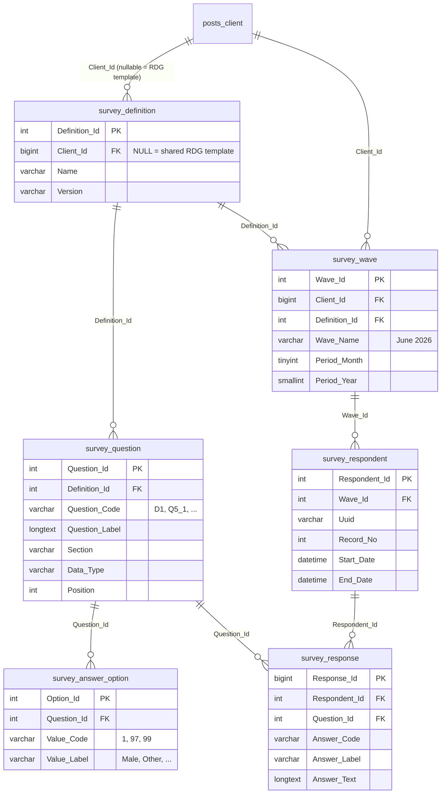
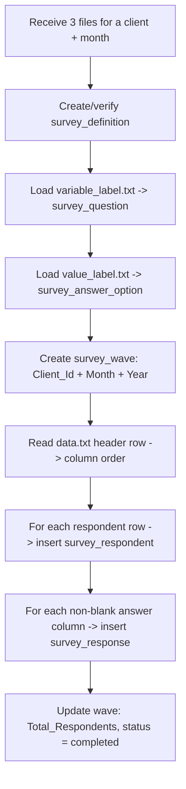
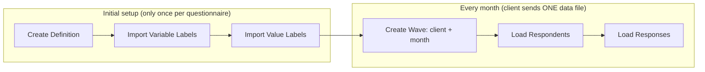

# Survey / Research Data — Import Solution

**Purpose:** How to store, map and import the client's market-research survey bundle
(`variable_label.txt` + `value_label.txt` + `data.txt`) into the database, and how to
connect each monthly drop back to a **Client**.

> This dataset is **not** mystery-shopping data (auditor scoring stores).
> It is a **consumer opinion survey** (SPSS / Forsta-style export) with a Limbic personality
> section. It therefore gets its **own set of tables** (`S3mVKQ_survey_*`), but it links to
> Clients the exact same way the mystery-shopping tables do — via `wp_posts.ID` where
> `post_type = rdg-client`.

---

## 1. The core idea (read this first)

The client always sends **three companion files**. None of them mean anything alone:

| File | Role | Becomes table |
|---|---|---|
| `variable_label.txt` | **Data dictionary** — what each *column* means (`D1` = "Are you…") + its position | `survey_question` |
| `value_label.txt` | **Codebook** — what each *number inside a column* means (`D1`: 1 = Male) | `survey_answer_option` |
| `data.txt` | **The answers** — one row per respondent, tab-separated, mostly numeric codes | `survey_respondent` + `survey_response` |

The wide `data.txt` (600+ columns) is turned into a **tall / long format**:

```
respondent_uuid | question_code | question_text | answer_code | answer_text
```

That single tall shape is what we actually store. It is easy to import, query, and it
survives new columns being added in future waves.

---

## 2. How monthly data connects to a Client

Every month the client sends a fresh `data.txt`. We wrap each drop in a **wave**:

```
Client (wp_posts, post_type = rdg-client)
   └── survey_wave        → one row per Client per MONTH  (e.g. "Coles – June 2026")
         └── survey_respondent  → one row per person in that month's file
               └── survey_response → one row per answered question (long format)
```

- **`survey_definition`** = the questionnaire itself (the set of questions/options). It is
  reused every month, so we import the two dictionaries **once per questionnaire version**.
- **`survey_wave`** = the monthly instance. This is the object that carries `Client_Id`,
  `Period_Month` and `Period_Year`. This is *the link between a Client and a given month.*

So "Client X, June 2026" = one `survey_wave` row, and everything hangs off it.

---

## 3. ER diagram



---

## 4. Tables explained one by one

### 4.1 `survey_definition` — the questionnaire
The reusable questionnaire (a "version"). Import the two dictionary files into this once.
`Client_Id` is nullable so RDG can hold a shared master template (same pattern as
`rdg_courses`). Normally it is the owning client.

### 4.2 `survey_question` — from `variable_label.txt`
One row per **column** in `data.txt`. Stores the code (`Q5_1`), the full question text,
which section it belongs to, its position, and a **`Data_Type`** we assign so the importer
knows how to treat it:

| `Data_Type` | Meaning | Example columns |
|---|---|---|
| `system` | metadata, not an answer | `record`, `uuid`, `start_date`, `qtime`, `VAR_TIME_*` |
| `single_choice` | pick one coded value | `D1`, `Q1`, `Q3` |
| `scale` | rating scale | `Q6_*`, `Q7_*`, `Q8_*` |
| `multi_select_flag` | 0/1 "one option of a multi-select" | `Q5_1`…`Q5_20`, `L3_*` |
| `open_text` | free text | `Q5_97_Other`, any `*_Other` |
| `numeric` | raw number | timing / count fields |

### 4.3 `survey_answer_option` — from `value_label.txt`
One row per **code → label** inside a question. `D1` → (1=Male, 2=Female, 3=Prefer not to say).
Reserved codes are consistent industry-wide and are just normal rows here:
`97 = Other`, `99 = None / N/A`.

### 4.4 `survey_wave` — the monthly link to a Client
One row per Client per month. Carries `Client_Id`, `Period_Month`, `Period_Year`, and the
uploaded file info + import status (mirrors `mystery_shopping_import_log`).

### 4.5 `survey_respondent` — from the metadata columns of `data.txt`
One row per person per wave. The left-hand system columns map straight onto it:
`record → Record_No`, `uuid → Uuid`, `start_date → Start_Date`, `date → End_Date`,
`qtime → Duration_Seconds`, `status → Status_Code`, `HidSample → Sample_Type`.

### 4.6 `survey_response` — the tall answers table
The heart of it. One row per **answered** question per respondent:
`Answer_Code` (raw number), `Answer_Label` (decoded via `survey_answer_option`),
`Answer_Text` (only for open-ends). **Blank cells are skipped** (blank = question not shown
by skip logic, which is *not* the same as a zero).

---

## 5. Column → table mapping (cheat sheet)

| `data.txt` column | Goes to | Notes |
|---|---|---|
| `record` | `survey_respondent.Record_No` | integer |
| `uuid` | `survey_respondent.Uuid` | unique per wave |
| `start_date` | `survey_respondent.Start_Date` | parse `DD/MM/YYYY HH:MM` |
| `date` | `survey_respondent.End_Date` | completion time |
| `qtime` | `survey_respondent.Duration_Seconds` | convert `H:MM:SS` → seconds |
| `status` | `survey_respondent.Status_Code` | 3 = Qualified, etc. |
| `HidSample` | `survey_respondent.Sample_Type` | 1 = Panel, 2/3 = Client sample |
| `D1`…`D10`, `L1`, `L2`, `Q1`…`Q24`, `BC*` | `survey_response` | one row each (if not blank) |
| `L3_*`, `Q5_*` (0/1 flags) | `survey_response` | store code + `Selected` / `Not Selected` |
| `*_Other`, `*_97_Other` | `survey_response.Answer_Text` | free text |
| `VAR_TIME_*`, `Hid_*`, `Prog_*`, `Pipe*` | *(optional)* | timing/logic helpers — usually skip |

---

## 6. The DDL — run this in the database

> Uses the **exact conventions** already in the mystery-shopping schema: InnoDB,
> `utf8mb4_unicode_ci`, and the `Client_Id` collation fix so the FK to `S3mVKQ_posts.ID`
> is legal. Replace the `S3mVKQ_` prefix if your `MS_TABLE_PREFIX` differs.

```sql
-- =====================================================================================
-- SURVEY SCHEMA  (run in dependency order)
--   1. survey_definition      (dep: wp_posts for Client)
--   2. survey_question        (dep: definition)
--   3. survey_answer_option   (dep: question)
--   4. survey_wave            (dep: wp_posts, definition)
--   5. survey_respondent      (dep: wave)
--   6. survey_response        (dep: respondent, question)
-- =====================================================================================

-- ------------------------------------------------------------------------------------
-- 1. DEFINITION (the reusable questionnaire)
-- ------------------------------------------------------------------------------------
DROP TABLE IF EXISTS `S3mVKQ_survey_definition`;
CREATE TABLE `S3mVKQ_survey_definition` (
  `Definition_Id` INT NOT NULL AUTO_INCREMENT,
  `Client_Id`     BIGINT(20) UNSIGNED DEFAULT NULL COMMENT 'FK wp_posts.ID (rdg-client). NULL = shared RDG template',
  `Name`          VARCHAR(255) COLLATE utf8mb4_unicode_ci NOT NULL,
  `Version`       VARCHAR(50)  COLLATE utf8mb4_unicode_ci DEFAULT 'v1',
  `Description`   LONGTEXT     COLLATE utf8mb4_unicode_ci,
  `IsActive`      TINYINT(1) NOT NULL DEFAULT 1,
  `Created_At`    TIMESTAMP NOT NULL DEFAULT CURRENT_TIMESTAMP,
  `Updated_At`    TIMESTAMP NOT NULL DEFAULT CURRENT_TIMESTAMP ON UPDATE CURRENT_TIMESTAMP,
  PRIMARY KEY (`Definition_Id`),
  UNIQUE KEY `uq_definition_client_name_ver` (`Client_Id`,`Name`,`Version`),
  KEY `idx_definition_client` (`Client_Id`)
) ENGINE=InnoDB DEFAULT CHARSET=utf8mb4 COLLATE=utf8mb4_unicode_ci
  COMMENT='A survey questionnaire version (reused across monthly waves)';

ALTER TABLE `S3mVKQ_survey_definition`
  MODIFY `Client_Id` BIGINT(20) UNSIGNED DEFAULT NULL
  COLLATE utf8mb3_general_ci COMMENT 'FK wp_posts.ID (rdg-client). NULL = shared RDG template';

ALTER TABLE `S3mVKQ_survey_definition`
  ADD CONSTRAINT `fk_survey_definition_client`
  FOREIGN KEY (`Client_Id`) REFERENCES `S3mVKQ_posts` (`ID`)
  ON UPDATE CASCADE ON DELETE CASCADE;

-- ------------------------------------------------------------------------------------
-- 2. QUESTION  (loaded from variable_label.txt)
-- ------------------------------------------------------------------------------------
DROP TABLE IF EXISTS `S3mVKQ_survey_question`;
CREATE TABLE `S3mVKQ_survey_question` (
  `Question_Id`    INT NOT NULL AUTO_INCREMENT,
  `Definition_Id`  INT NOT NULL,
  `Question_Code`  VARCHAR(100) COLLATE utf8mb4_unicode_ci NOT NULL COMMENT 'e.g. D1, Q5_1, L3_12',
  `Question_Label` LONGTEXT     COLLATE utf8mb4_unicode_ci COMMENT 'Full question text',
  `Section`        VARCHAR(100) COLLATE utf8mb4_unicode_ci DEFAULT NULL COMMENT 'Demographics, Limbic, Q5, ...',
  `Base_Code`      VARCHAR(50)  COLLATE utf8mb4_unicode_ci DEFAULT NULL COMMENT 'Parent question, e.g. Q5 for Q5_1',
  `Data_Type`     VARCHAR(50)  COLLATE utf8mb4_unicode_ci NOT NULL DEFAULT 'single_choice'
                   COMMENT 'system | single_choice | scale | multi_select_flag | open_text | numeric',
  `Position`       INT DEFAULT NULL COMMENT 'Column position from variable_label.txt',
  `IsActive`       TINYINT(1) NOT NULL DEFAULT 1,
  `Created_At`     TIMESTAMP NOT NULL DEFAULT CURRENT_TIMESTAMP,
  `Updated_At`     TIMESTAMP NOT NULL DEFAULT CURRENT_TIMESTAMP ON UPDATE CURRENT_TIMESTAMP,
  PRIMARY KEY (`Question_Id`),
  UNIQUE KEY `uq_question_definition_code` (`Definition_Id`,`Question_Code`),
  KEY `idx_question_definition` (`Definition_Id`),
  KEY `idx_question_section` (`Section`),
  CONSTRAINT `fk_question_definition` FOREIGN KEY (`Definition_Id`)
    REFERENCES `S3mVKQ_survey_definition` (`Definition_Id`)
    ON DELETE CASCADE ON UPDATE CASCADE
) ENGINE=InnoDB DEFAULT CHARSET=utf8mb4 COLLATE=utf8mb4_unicode_ci
  COMMENT='One row per column in data.txt (the data dictionary)';

-- ------------------------------------------------------------------------------------
-- 3. ANSWER OPTION  (loaded from value_label.txt)
-- ------------------------------------------------------------------------------------
DROP TABLE IF EXISTS `S3mVKQ_survey_answer_option`;
CREATE TABLE `S3mVKQ_survey_answer_option` (
  `Option_Id`   INT NOT NULL AUTO_INCREMENT,
  `Question_Id` INT NOT NULL,
  `Value_Code`  VARCHAR(50)  COLLATE utf8mb4_unicode_ci NOT NULL COMMENT 'e.g. 1, 97, 99',
  `Value_Label` VARCHAR(500) COLLATE utf8mb4_unicode_ci NOT NULL COMMENT 'e.g. Male, Other, None',
  `Created_At`  TIMESTAMP NOT NULL DEFAULT CURRENT_TIMESTAMP,
  PRIMARY KEY (`Option_Id`),
  UNIQUE KEY `uq_option_question_code` (`Question_Id`,`Value_Code`),
  KEY `idx_option_question` (`Question_Id`),
  CONSTRAINT `fk_option_question` FOREIGN KEY (`Question_Id`)
    REFERENCES `S3mVKQ_survey_question` (`Question_Id`)
    ON DELETE CASCADE ON UPDATE CASCADE
) ENGINE=InnoDB DEFAULT CHARSET=utf8mb4 COLLATE=utf8mb4_unicode_ci
  COMMENT='Code -> label lookup per question (the codebook)';

-- ------------------------------------------------------------------------------------
-- 4. WAVE  (the monthly link to a Client)
-- ------------------------------------------------------------------------------------
DROP TABLE IF EXISTS `S3mVKQ_survey_wave`;
CREATE TABLE `S3mVKQ_survey_wave` (
  `Wave_Id`           INT NOT NULL AUTO_INCREMENT,
  `Client_Id`         BIGINT(20) UNSIGNED NOT NULL,
  `Definition_Id`     INT NOT NULL,
  `Wave_Name`         VARCHAR(255) COLLATE utf8mb4_unicode_ci DEFAULT NULL COMMENT 'e.g. "June 2026"',
  `Period_Month`      TINYINT UNSIGNED NOT NULL COMMENT '1-12',
  `Period_Year`       SMALLINT UNSIGNED NOT NULL,
  `Period_Date`       DATE DEFAULT NULL COMMENT 'First of month, for easy sorting',
  `File_Name`         VARCHAR(255) COLLATE utf8mb4_unicode_ci DEFAULT NULL,
  `File_Path`         LONGTEXT     COLLATE utf8mb4_unicode_ci,
  `Total_Respondents` INT DEFAULT 0,
  `Import_Status`     ENUM('pending','in_progress','completed','failed')
                        COLLATE utf8mb4_unicode_ci DEFAULT 'pending',
  `Imported_By`       VARCHAR(255) COLLATE utf8mb4_unicode_ci DEFAULT NULL,
  `IsActive`          TINYINT(1) NOT NULL DEFAULT 1,
  `Created_At`        TIMESTAMP NOT NULL DEFAULT CURRENT_TIMESTAMP,
  `Updated_At`        TIMESTAMP NOT NULL DEFAULT CURRENT_TIMESTAMP ON UPDATE CURRENT_TIMESTAMP,
  PRIMARY KEY (`Wave_Id`),
  UNIQUE KEY `uq_wave_client_def_period` (`Client_Id`,`Definition_Id`,`Period_Year`,`Period_Month`),
  KEY `idx_wave_client` (`Client_Id`),
  KEY `idx_wave_period` (`Period_Year`,`Period_Month`),
  CONSTRAINT `fk_wave_definition` FOREIGN KEY (`Definition_Id`)
    REFERENCES `S3mVKQ_survey_definition` (`Definition_Id`)
    ON DELETE CASCADE ON UPDATE CASCADE
) ENGINE=InnoDB DEFAULT CHARSET=utf8mb4 COLLATE=utf8mb4_unicode_ci
  COMMENT='One monthly data drop per client';

ALTER TABLE `S3mVKQ_survey_wave`
  MODIFY `Client_Id` BIGINT(20) UNSIGNED NOT NULL
  COLLATE utf8mb3_general_ci COMMENT 'FK wp_posts.ID (rdg-client)';

ALTER TABLE `S3mVKQ_survey_wave`
  ADD CONSTRAINT `fk_wave_client`
  FOREIGN KEY (`Client_Id`) REFERENCES `S3mVKQ_posts` (`ID`)
  ON UPDATE CASCADE ON DELETE RESTRICT;

-- ------------------------------------------------------------------------------------
-- 5. RESPONDENT  (one row per person per wave)
-- ------------------------------------------------------------------------------------
DROP TABLE IF EXISTS `S3mVKQ_survey_respondent`;
CREATE TABLE `S3mVKQ_survey_respondent` (
  `Respondent_Id`    INT NOT NULL AUTO_INCREMENT,
  `Wave_Id`          INT NOT NULL,
  `Uuid`             VARCHAR(64) COLLATE utf8mb4_unicode_ci NOT NULL,
  `Record_No`        INT DEFAULT NULL,
  `Status_Code`      TINYINT DEFAULT NULL COMMENT 'raw status code (3 = Qualified)',
  `Sample_Type`      VARCHAR(100) COLLATE utf8mb4_unicode_ci DEFAULT NULL,
  `Start_Date`       DATETIME DEFAULT NULL,
  `End_Date`         DATETIME DEFAULT NULL,
  `Duration_Seconds` INT DEFAULT NULL COMMENT 'qtime converted to seconds',
  `IsActive`         TINYINT(1) NOT NULL DEFAULT 1,
  `Created_At`       TIMESTAMP NOT NULL DEFAULT CURRENT_TIMESTAMP,
  PRIMARY KEY (`Respondent_Id`),
  UNIQUE KEY `uq_respondent_wave_uuid` (`Wave_Id`,`Uuid`),
  KEY `idx_respondent_wave` (`Wave_Id`),
  CONSTRAINT `fk_respondent_wave` FOREIGN KEY (`Wave_Id`)
    REFERENCES `S3mVKQ_survey_wave` (`Wave_Id`)
    ON DELETE CASCADE ON UPDATE CASCADE
) ENGINE=InnoDB DEFAULT CHARSET=utf8mb4 COLLATE=utf8mb4_unicode_ci
  COMMENT='One survey respondent (one data.txt row) per wave';

-- ------------------------------------------------------------------------------------
-- 6. RESPONSE  (the tall answers table)
-- ------------------------------------------------------------------------------------
DROP TABLE IF EXISTS `S3mVKQ_survey_response`;
CREATE TABLE `S3mVKQ_survey_response` (
  `Response_Id`   BIGINT NOT NULL AUTO_INCREMENT,
  `Respondent_Id` INT NOT NULL,
  `Question_Id`   INT NOT NULL,
  `Answer_Code`   VARCHAR(50)  COLLATE utf8mb4_unicode_ci DEFAULT NULL COMMENT 'raw code from data.txt',
  `Answer_Label`  VARCHAR(500) COLLATE utf8mb4_unicode_ci DEFAULT NULL COMMENT 'decoded via answer_option',
  `Answer_Text`   LONGTEXT     COLLATE utf8mb4_unicode_ci COMMENT 'free text (open-ends only)',
  `Created_At`    TIMESTAMP NOT NULL DEFAULT CURRENT_TIMESTAMP,
  PRIMARY KEY (`Response_Id`),
  UNIQUE KEY `uq_response_respondent_question` (`Respondent_Id`,`Question_Id`),
  KEY `idx_response_respondent` (`Respondent_Id`),
  KEY `idx_response_question` (`Question_Id`),
  CONSTRAINT `fk_response_respondent` FOREIGN KEY (`Respondent_Id`)
    REFERENCES `S3mVKQ_survey_respondent` (`Respondent_Id`)
    ON DELETE CASCADE ON UPDATE CASCADE,
  CONSTRAINT `fk_response_question` FOREIGN KEY (`Question_Id`)
    REFERENCES `S3mVKQ_survey_question` (`Question_Id`)
    ON UPDATE CASCADE ON DELETE CASCADE
) ENGINE=InnoDB DEFAULT CHARSET=utf8mb4 COLLATE=utf8mb4_unicode_ci
  COMMENT='One row per answered question per respondent (long format)';

-- =====================================================================================
-- END OF SURVEY SCHEMA
-- =====================================================================================
```

---

## 7. The end-to-end import process



**Steps 2–4 run once per questionnaire version.** Steps 5–8 run every month.

> **Ongoing months = Data file only.**
> After the first setup you will **not** receive the two dictionaries again — only a fresh
> `data.txt` (as Excel/CSV). The questionnaire is already stored in `survey_definition` /
> `survey_question` / `survey_answer_option`, so each month you only do: **create a new
> `survey_wave`** → **load the respondents + responses**. The importer reuses the existing
> dictionaries to decode the new file. Only re-run steps 2–4 if the client changes the
> questionnaire (new/renamed columns or codes) — in that case bump the `Version` on a new
> `survey_definition` row so old waves keep decoding correctly.

### 7.1 Parsing rules the importer must follow

- **All files are TAB-delimited.** Split on `\t`, not comma. Handle quoted multi-line cells
  in `data.txt` (open-ends contain line breaks) — the project already has this logic in
  [assets/js/import_js/excel-parser.js](../assets/js/import_js/excel-parser.js).
- **`value_label.txt` uses continuation lines:** a line whose **first column is blank**
  belongs to the variable named on the line above. Track a "current variable" while parsing.
- **Blank data cell = skip** (question not shown by skip logic). Do **not** insert a row.
- **`qtime` `H:MM:SS` → seconds**; **`DD/MM/YYYY HH:MM` → MySQL `DATETIME`**.
- **Open-ends** (`*_Other`) → `Answer_Text`; leave `Answer_Code` NULL.
- **0/1 flags** (`Q5_*`, `L3_*`) → store code `0`/`1` and label `Not Selected`/`Selected`.
  (Tip: to save space you can skip the `0` rows and only store what was `Selected`.)

### 7.2 Import routine (PHP / WordPress — matches the existing stack)

```php
/**
 * Import one monthly survey drop for a client.
 *
 * @param int    $client_id      wp_posts.ID (rdg-client)
 * @param int    $definition_id  existing survey_definition (dictionaries already loaded)
 * @param int    $month          1-12
 * @param int    $year           e.g. 2026
 * @param string $data_file      absolute path to data.txt
 */
function rdg_import_survey_wave($client_id, $definition_id, $month, $year, $data_file) {
    global $wpdb;
    $p = constant('MS_TABLE_PREFIX') ?: 'S3mVKQ_';

    // 1. Build a fast lookup: Question_Code => [Question_Id, Data_Type]
    $qrows = $wpdb->get_results($wpdb->prepare(
        "SELECT Question_Id, Question_Code, Data_Type
           FROM {$p}survey_question WHERE Definition_Id = %d", $definition_id));
    $qmap = [];
    foreach ($qrows as $q) { $qmap[$q->Question_Code] = $q; }

    // 2. Build code->label lookup: Question_Id => [Value_Code => Value_Label]
    $orows = $wpdb->get_results($wpdb->prepare(
        "SELECT o.Question_Id, o.Value_Code, o.Value_Label
           FROM {$p}survey_answer_option o
           INNER JOIN {$p}survey_question q ON q.Question_Id = o.Question_Id
          WHERE q.Definition_Id = %d", $definition_id));
    $labels = [];
    foreach ($orows as $o) { $labels[$o->Question_Id][$o->Value_Code] = $o->Value_Label; }

    $wpdb->query('START TRANSACTION');
    try {
        // 3. Create the wave (the client + month link)
        $wpdb->insert("{$p}survey_wave", [
            'Client_Id'     => $client_id,
            'Definition_Id' => $definition_id,
            'Wave_Name'     => date('F Y', mktime(0,0,0,$month,1,$year)),
            'Period_Month'  => $month,
            'Period_Year'   => $year,
            'Period_Date'   => sprintf('%04d-%02d-01', $year, $month),
            'File_Name'     => basename($data_file),
            'Import_Status' => 'in_progress',
            'Imported_By'   => wp_get_current_user()->user_login,
        ]);
        $wave_id = $wpdb->insert_id;

        // 4. Read the tab-delimited file
        $rows   = array_map(fn($l) => explode("\t", rtrim($l, "\r\n")),
                            file($data_file, FILE_IGNORE_NEW_LINES));
        $header = array_shift($rows);              // column codes, in order
        $count  = 0;

        // System columns that map onto the respondent row
        $sys = ['record','uuid','start_date','date','qtime','status','HidSample'];

        foreach ($rows as $row) {
            $cells = array_combine($header, array_pad($row, count($header), ''));

            // 5. Insert the respondent
            $wpdb->insert("{$p}survey_respondent", [
                'Wave_Id'          => $wave_id,
                'Uuid'             => $cells['uuid'] ?? '',
                'Record_No'        => (int)($cells['record'] ?? 0),
                'Status_Code'      => is_numeric($cells['status'] ?? '') ? (int)$cells['status'] : null,
                'Sample_Type'      => $cells['HidSample'] ?? null,
                'Start_Date'       => rdg_survey_parse_dt($cells['start_date'] ?? ''),
                'End_Date'         => rdg_survey_parse_dt($cells['date'] ?? ''),
                'Duration_Seconds' => rdg_survey_hms_to_sec($cells['qtime'] ?? ''),
            ]);
            $respondent_id = $wpdb->insert_id;

            // 6. Insert every non-blank answer (long format)
            foreach ($cells as $code => $value) {
                if (in_array($code, $sys, true)) continue;   // already stored
                if ($value === '' || $value === null)  continue;   // blank = not shown
                if (!isset($qmap[$code]))               continue;   // unknown column
                $q = $qmap[$code];
                if ($q->Data_Type === 'system' || $q->Data_Type === 'numeric') continue;

                $is_text = ($q->Data_Type === 'open_text');
                $wpdb->insert("{$p}survey_response", [
                    'Respondent_Id' => $respondent_id,
                    'Question_Id'   => $q->Question_Id,
                    'Answer_Code'   => $is_text ? null : $value,
                    'Answer_Label'  => $is_text ? null : ($labels[$q->Question_Id][$value] ?? null),
                    'Answer_Text'   => $is_text ? $value : null,
                ]);
            }
            $count++;
        }

        // 7. Finalise the wave
        $wpdb->update("{$p}survey_wave",
            ['Total_Respondents' => $count, 'Import_Status' => 'completed'],
            ['Wave_Id' => $wave_id]);

        $wpdb->query('COMMIT');
        return ['wave_id' => $wave_id, 'respondents' => $count];
    } catch (Exception $e) {
        $wpdb->query('ROLLBACK');
        error_log('Survey import failed: ' . $e->getMessage());
        return new WP_Error('survey_import_failed', $e->getMessage());
    }
}

// --- helpers -------------------------------------------------------------
function rdg_survey_parse_dt($s) {                 // "22/06/2026 21:14" -> DATETIME
    $s = trim($s);
    if ($s === '') return null;
    $d = DateTime::createFromFormat('d/m/Y H:i', $s);
    return $d ? $d->format('Y-m-d H:i:s') : null;
}
function rdg_survey_hms_to_sec($s) {               // "0:09:10" -> 550
    $s = trim($s);
    if ($s === '' || strpos($s, ':') === false) return null;
    $parts = array_map('intval', explode(':', $s));
    while (count($parts) < 3) array_unshift($parts, 0);
    return $parts[0]*3600 + $parts[1]*60 + $parts[2];
}
```

### 7.3 Loading the two dictionaries (run once per version)

```php
// variable_label.txt -> survey_question   (skip the 2 header lines)
// columns: Variable \t Position \t Label
foreach ($variable_rows as [$code, $position, $label]) {
    $wpdb->insert("{$p}survey_question", [
        'Definition_Id' => $definition_id,
        'Question_Code' => $code,
        'Question_Label'=> $label,
        'Base_Code'     => preg_replace('/_\d+.*$/', '', $code),   // Q5_1 -> Q5
        'Section'       => rdg_survey_section_of($code),            // your own rules
        'Data_Type'     => rdg_survey_type_of($code),               // see table in §4.2
        'Position'      => (int)$position,
    ]);
}

// value_label.txt -> survey_answer_option  (mind the continuation lines!)
$current_code = null;
foreach ($value_rows as [$col1, $value, $label]) {
    if (trim($col1) !== '') {                 // new variable starts
        $current_code = trim($col1);
        // first data line of a variable ALSO carries a value+label
    }
    if ($current_code === null || $value === '') continue;
    $qid = $qmap[$current_code]->Question_Id ?? null;
    if (!$qid) continue;
    $wpdb->insert("{$p}survey_answer_option", [
        'Question_Id' => $qid,
        'Value_Code'  => trim($value),
        'Value_Label' => trim($label),
    ]);
}
```

---

## 8. Example queries (proving the monthly + client link works)

```sql
-- All of Client 123's waves (each = one month)
SELECT Wave_Id, Wave_Name, Period_Year, Period_Month, Total_Respondents
FROM   S3mVKQ_survey_wave
WHERE  Client_Id = 123
ORDER  BY Period_Year, Period_Month;

-- Gender split for Client 123, June 2026 (decoded, human-readable)
SELECT r.Answer_Label AS gender, COUNT(*) AS n
FROM   S3mVKQ_survey_response r
JOIN   S3mVKQ_survey_respondent p ON p.Respondent_Id = r.Respondent_Id
JOIN   S3mVKQ_survey_wave       w ON w.Wave_Id       = p.Wave_Id
JOIN   S3mVKQ_survey_question   q ON q.Question_Id   = r.Question_Id
WHERE  w.Client_Id = 123 AND w.Period_Year = 2026 AND w.Period_Month = 6
  AND  q.Question_Code = 'D1'
GROUP  BY r.Answer_Label;

-- Read a single respondent fully decoded
SELECT q.Question_Code, q.Question_Label,
       COALESCE(r.Answer_Text, r.Answer_Label, r.Answer_Code) AS answer
FROM   S3mVKQ_survey_response r
JOIN   S3mVKQ_survey_question q ON q.Question_Id = r.Question_Id
WHERE  r.Respondent_Id = 5001
ORDER  BY q.Position;
```

---

## 9. Summary — what to tell your junior

1. It's a **standard 3-file survey export**: data + column dictionary + value codebook.
2. We store it in **6 tables** (`survey_definition`, `survey_question`, `survey_answer_option`,
   `survey_wave`, `survey_respondent`, `survey_response`) — separate from mystery shopping.
3. The **dictionaries load once**; each month you create **one `survey_wave`** for the
   `Client + month`, then flatten `data.txt` into `survey_respondent` + `survey_response`.
4. The **client + month link is the `survey_wave` row** — that's the whole trick.
5. **Blank ≠ 0** (skip blanks), decode codes via the codebook, put open-ends in `Answer_Text`.

> **Before running in production:** confirm with the project owner whether the Limbic section
> (`L1/L2/L3_*`) should also cross-link to the existing ACF **Limbic Profile** records. If yes,
> add a nullable `Limbic_Profile_Post_Id` to `survey_respondent` and map it after import.

---

## 10. What the tables look like after import (worked example)

Below are **real values decoded from the first rows of `data.txt`**, showing exactly what
lands in each table after one import. (Client `123` is used as an example `wp_posts.ID`.)

### 10.1 `survey_definition` — loaded once at setup

| Definition_Id | Client_Id | Name | Version | IsActive |
|---|---|---|---|---|
| 1 | 123 | Plus-Size Fashion Study | v1 | 1 |

### 10.2 `survey_question` — loaded once from `variable_label.txt`

| Question_Id | Definition_Id | Question_Code | Question_Label | Section | Base_Code | Data_Type | Position |
|---|---|---|---|---|---|---|---|
| 8  | 1 | D1   | Are you… | Demographics | D1 | single_choice | 8 |
| 9  | 1 | D2   | What is your age? | Demographics | D2 | single_choice | 9 |
| 10 | 1 | D3   | In which state do you live? | Demographics | D3 | single_choice | 10 |
| 12 | 1 | D5   | What Australian clothing size do you buy most often for yourself? | Demographics | D5 | single_choice | 12 |
| 14 | 1 | L1   | 7 sets of words — attitude to life you find most appealing | Limbic | L1 | single_choice | 14 |
| 15 | 1 | L2   | Most important term that describes you best | Limbic | L2 | single_choice | 15 |
| 22 | 1 | L3_7 | 5 additional terms — Risk-taking | Limbic | L3 | multi_select_flag | 22 |
| 45 | 1 | Q1   | How frequently do you shop for clothes? | Q1 | Q1 | single_choice | 45 |
| 54 | 1 | Q5_3 | Where do you follow fashion & style? — TikTok | Q5 | Q5 | multi_select_flag | 54 |
| 61 | 1 | Q5_10| Where do you follow fashion & style? — Seeing other people wearing it | Q5 | Q5 | multi_select_flag | 61 |

### 10.3 `survey_answer_option` — loaded once from `value_label.txt`

| Option_Id | Question_Id | Value_Code | Value_Label |
|---|---|---|---|
| 101 | 8  | 1 | Male |
| 102 | 8  | 2 | Female |
| 103 | 8  | 3 | Prefer not to say |
| 120 | 12 | 2 | 8 |
| 140 | 14 | 4 | Openness, love of life, imagination, easy-going |
| 155 | 15 | 3 | Disciplined |
| 220 | 22 | 0 | Not Selected |
| 221 | 22 | 1 | Selected |
| 245 | 45 | 3 | About every 6 months |
| 540 | 54 | 1 | Selected |
| 610 | 61 | 1 | Selected |

### 10.4 `survey_wave` — one new row **each month**

| Wave_Id | Client_Id | Definition_Id | Wave_Name | Period_Month | Period_Year | Period_Date | File_Name | Total_Respondents | Import_Status |
|---|---|---|---|---|---|---|---|---|---|
| 1 | 123 | 1 | June 2026 | 6 | 2026 | 2026-06-01 | data.txt | 62 | completed |

### 10.5 `survey_respondent` — one row per `data.txt` row

| Respondent_Id | Wave_Id | Uuid | Record_No | Status_Code | Sample_Type | Start_Date | End_Date | Duration_Seconds |
|---|---|---|---|---|---|---|---|---|
| 1 | 1 | zte5ru2dj1eej0xu | 1 | 3 | 1 | 2026-06-22 21:14:00 | 2026-06-22 21:21:00 | 424 |
| 2 | 1 | 4scy3dffkn7z1tec | 2 | 3 | 1 | 2026-06-22 21:17:00 | 2026-06-22 21:27:00 | 550 |

> `qtime` `0:07:04` → **424** seconds; `0:09:10` → **550** seconds.
> `status = 3` = Qualified, `HidSample = 1` = Panel-Sample (kept as raw code + decoded on read).

### 10.6 `survey_response` — the tall answers (respondent 1 = uuid `zte5ru2dj1eej0xu`)

Raw row 1 reads `… D1=2  D2=2  D3=7  D5=2 … L1=4  L2=3 … Q1=3 …` — here it is decoded:

| Response_Id | Respondent_Id | Question_Id | Question_Code | Answer_Code | Answer_Label | Answer_Text |
|---|---|---|---|---|---|---|
| 1 | 1 | 8  | D1    | 2 | Female | NULL |
| 2 | 1 | 9  | D2    | 2 | 18-24 years | NULL |
| 3 | 1 | 10 | D3    | 7 | Victoria | NULL |
| 4 | 1 | 12 | D5    | 2 | 8 | NULL |
| 5 | 1 | 14 | L1    | 4 | Openness, love of life, imagination, easy-going | NULL |
| 6 | 1 | 15 | L2    | 3 | Disciplined | NULL |
| 7 | 1 | 45 | Q1    | 3 | About every 6 months | NULL |
| 8 | 1 | 22 | L3_7  | 1 | Selected | NULL |
| 9 | 1 | 54 | Q5_3  | 1 | Selected | NULL |
| 10| 1 | 61 | Q5_10 | 1 | Selected | NULL |

Notes on this respondent:
- **Blanks are skipped.** In row 1, `L3_3` is empty (not shown) → **no row** is created for it.
- **Multi-select** questions (`L3_*`, `Q5_*`) only produce rows where the flag = `1`
  (Selected). She picked 5 Limbic terms — Risk-taking, Dependable, Imaginative, Nostalgic,
  Sensible — and follows fashion via TikTok + "seeing other people wearing it".
- **Open-ends** (e.g. `Q16_97_Other`) would fill `Answer_Text` with `Answer_Code`/`Answer_Label`
  left NULL. Row 1 has a brand name (`Kmart`) in an open-end field → stored as `Answer_Text`.

### 10.7 How it reads back (the join that produces a human report)

```sql
SELECT p.Uuid, q.Question_Code,
       COALESCE(r.Answer_Text, r.Answer_Label) AS answer
FROM   S3mVKQ_survey_response  r
JOIN   S3mVKQ_survey_respondent p ON p.Respondent_Id = r.Respondent_Id
JOIN   S3mVKQ_survey_question   q ON q.Question_Id   = r.Question_Id
WHERE  p.Uuid = 'zte5ru2dj1eej0xu'
ORDER  BY q.Position;
```

| Uuid | Question_Code | answer |
|---|---|---|
| zte5ru2dj1eej0xu | D1 | Female |
| zte5ru2dj1eej0xu | D2 | 18-24 years |
| zte5ru2dj1eej0xu | D3 | Victoria |
| zte5ru2dj1eej0xu | D5 | 8 |
| zte5ru2dj1eej0xu | L1 | Openness, love of life, imagination, easy-going |
| zte5ru2dj1eej0xu | L2 | Disciplined |
| zte5ru2dj1eej0xu | Q1 | About every 6 months |

That is the whole point of the design: the client sends coded numbers, but any report reads
back in plain English — for **any client, any month** — just by filtering on the `survey_wave`.

---

## 11. Developer build & operate guide (no code — just the steps)

> Read this top-to-bottom. It assumes you have **never seen this project**. It explains
> **why** the Client link works the way it does, **what order** to fill the tables, **what
> each screen looks like**, and **how the odd columns are handled**. No code here — just
> "do this, then this".

### 11.1 First understand: where does a "Client" live? (the post-meta link)

This is the part that confuses everyone on day one, so read it slowly.

**There is no `clients` table.** In this WordPress + ACF site a Client is a **WordPress
post** with `post_type = rdg-client`, stored in `S3mVKQ_posts`. All its details (client code,
colours, thresholds, etc.) are **ACF fields** saved in `S3mVKQ_postmeta` under names like
`rdg_client_code`. The mystery-shopping tables already work this way, and we copy the same
pattern for consistency.

So when we want to say "this survey belongs to Coles", we do **not** duplicate the client
into our tables. We store the **WordPress post ID** of that client in our `Client_Id` column,
and add a foreign key to `S3mVKQ_posts.ID`. One sentence to memorise:

> **`Client_Id` = a WordPress post ID. The client already exists as a post; we just point at it.**

Two consequences that the rest of this guide relies on:

1. **The tables that carry `Client_Id`** are `survey_definition` and `survey_wave` (the "top"
   tables). Everything below them inherits the client through those.
2. **The client dropdown in the UI is filled from WordPress posts**, *not* from our survey
   tables — because that is where clients actually live. (How, in §11.4.1.)

### 11.2 The golden rule — fill the tables top to bottom

The tables have a strict parent → child order. Always create the parent before the child, or
the foreign keys will reject the insert:

| Order | Table | Filled from | When |
|---|---|---|---|
| 1 | `survey_definition` | you (name the questionnaire + pick client) | **once** |
| 2 | `survey_question` | `variable_label.txt` | **once** |
| 3 | `survey_answer_option` | `value_label.txt` | **once** |
| 4 | `survey_wave` | you (pick client + month) | **every month** |
| 5 | `survey_respondent` | `data.txt` (the metadata columns) | **every month** |
| 6 | `survey_response` | `data.txt` (the answer columns) | **every month** |

### 11.3 One-time setup vs the monthly job



**Key fact you asked about:** after setup, the client sends **only the data file** each month.
The two dictionaries (variable + value labels) are already stored, so the importer just
**decodes** the new file against them. You only revisit the setup tabs if the client changes
the questionnaire (new/renamed columns or new codes) — then you make a **new definition with a
new `Version`** so old months keep decoding correctly.

### 11.4 The screens — a 4-part tabbed wizard

Build it as one tabbed page (same style as the existing import screen with its HOED-config
tab). The **Client selector sits above the tabs** so it applies to whichever tab you are on.

```
┌──────────────────────────────────────────────────────────────────────────┐
│  SURVEY IMPORT                              Client:  [ Coles ▼ ]           │
├───────────────┬───────────────┬────────────────────────┬─────────────────┤
│ 1 · Variable  │ 2 · Value     │ 3 · Upload Data         │                 │
│    Labels     │    Labels     │    (monthly)            │                 │
│  (setup)      │  (setup)      │                         │                 │
└───────────────┴───────────────┴────────────────────────┴─────────────────┘
```

- **Tabs 1 & 2 = one-time setup** (greyed out / marked "done" once a definition exists).
- **Tab 3 = the monthly job** everyone uses from then on.

#### 11.4.1 The Client dropdown (top of every tab)

Because clients are WordPress posts, populate this `<select>` by asking WordPress for all
active `rdg-client` posts (ordered by title), and put the **post ID as the option value** and
the **client name as the label**:

```
Client:  [ -- choose client -- ▼ ]
         ├─ Coles            (value = post ID 123)
         ├─ Bunnings         (value = post ID 145)
         └─ Forever New      (value = post ID 160)
```

Whatever the user picks, that **post ID becomes `Client_Id`** on the definition (setup) or the
wave (monthly). This is the single point where "which client?" is answered — everything else
flows from it. Nothing is typed by hand, so there are no spelling mistakes and no orphan data.

#### 11.4.2 Tab 1 — Variable Labels (build the question list)

Purpose: turn `variable_label.txt` into `survey_question` rows.

```
┌─ 1 · Variable Labels ──────────────────────────────────────────────┐
│  Questionnaire name: [ Plus-Size Fashion Study        ]  Version: [v1]
│  Upload variable_label.txt:  [ Choose file ]  [ Preview ]           │
│                                                                     │
│  Preview / edit before saving:                                      │
│  ┌────────┬───────────────────────────────┬─────────────┬────────┐ │
│  │ Code   │ Question label                │ Section     │ Type   │ │
│  ├────────┼───────────────────────────────┼─────────────┼────────┤ │
│  │ D1     │ Are you…                      │ Demographics│ single │ │
│  │ Q5_1   │ …follow fashion — Instagram   │ Q5          │ multi  │ │
│  │ Q5_97_Other │ …follow fashion — Other   │ Q5          │ text   │ │
│  │ VAR_TIME_1 │ Screening (timer)          │ —           │ system │ │
│  └────────┴───────────────────────────────┴─────────────┴────────┘ │
│                                   [ Save questions → definition ]   │
└─────────────────────────────────────────────────────────────────────┘
```

What the developer does here:
1. Type the questionnaire **name + version** → this creates the `survey_definition` row
   (with the selected `Client_Id`).
2. Upload the variable-label file. The screen shows every column as a row.
3. The system **pre-fills `Section` and `Data_Type`** automatically (rules in §11.5 and
   §11.6); the developer just eyeballs and corrects any oddities in the two dropdowns.
4. Save → writes all `survey_question` rows.

#### 11.4.3 Tab 2 — Value Labels (attach the code→text meanings)

Purpose: turn `value_label.txt` into `survey_answer_option` rows, **matched to the questions
saved in Tab 1**.

```
┌─ 2 · Value Labels ─────────────────────────────────────────────────┐
│  Upload value_label.txt:  [ Choose file ]  [ Match ]                │
│                                                                     │
│  Matched preview (grouped by question):                             │
│  ▸ D1  Are you…            1=Male  2=Female  3=Prefer not to say ✅   │
│  ▸ D5  Clothing size       1=6 2=8 3=10 … 11=Prefer not to say  ✅   │
│  ▸ Q5_1 …Instagram         0=Not Selected  1=Selected           ✅   │
│  ⚠ Q99_x  (no matching question found in Tab 1)                 ❌   │
│                                                                     │
│                                   [ Save options → questions ]      │
└─────────────────────────────────────────────────────────────────────┘
```

What the developer does here:
1. Upload the value-label file.
2. The system reads it (remembering the **continuation-line rule** — a blank first column
   means "same question as the line above") and **matches each block to a question by its
   code**.
3. Green ✅ = matched and will be saved. Red ⚠ = a code with no matching question (usually a
   typo or a column that was dropped) — fix or ignore.
4. Save → writes all `survey_answer_option` rows.

**Setup is now complete.** Tabs 1 & 2 are not touched again unless the questionnaire changes.

#### 11.4.4 Tab 3 — Upload Data (the monthly job)

Purpose: create the month's `survey_wave`, then load respondents + responses from the single
data file.

```
┌─ 3 · Upload Data (monthly) ────────────────────────────────────────┐
│  Client: Coles (from top)    Definition: Plus-Size Fashion Study v1 │
│  Period:  Month [ June ▼ ]   Year [ 2026 ▼ ]                        │
│  Upload data file (.xlsx / .csv / .txt):  [ Choose file ]           │
│                                                                     │
│  Preview (first rows, DECODED so you can sanity-check):             │
│  ┌──────┬──────────────────┬────────┬──────────┬──────────┐        │
│  │ rec  │ uuid             │ D1     │ D3       │ Q1       │        │
│  ├──────┼──────────────────┼────────┼──────────┼──────────┤        │
│  │ 1    │ zte5ru2dj1eej0xu │ Female │ Victoria │ ~6 months│        │
│  └──────┴──────────────────┴────────┴──────────┴──────────┘        │
│  Rows detected: 62      Unknown columns: 0                          │
│                                          [ Import this month ]      │
│  ───────────────────────────────────────────────────────────────── │
│  ✔ Imported 62 respondents · 5,140 answers · wave "June 2026"       │
└─────────────────────────────────────────────────────────────────────┘
```

What the developer/operator does here every month:
1. Pick **client** (top) + **month/year**.
2. Upload the data file (it may arrive as `.xlsx` — the existing PHP converter turns it into
   CSV first, exactly like the current import flow).
3. The preview **decodes the first few rows** using the stored dictionaries so you can catch a
   wrong file before importing. If a column in the file isn't in the dictionary it's flagged
   under "Unknown columns" (that signals the questionnaire changed → make a new version).
4. Click **Import** → creates the `survey_wave` and loads `survey_respondent` +
   `survey_response`. A success line confirms counts.

### 11.5 How the sections separate (the `VAR_TIME_x` columns)

The client's file is not one flat list — it is divided into **sections**, and the dividers are
the `VAR_TIME_1 … VAR_TIME_7` columns. In the variable-label file each one is literally named
after the section it opens, e.g. *"VAR_TIME_1 – Screening"*, *"VAR_TIME_2 – Limbic Profiling"*.

How we handle it (in Tab 1, automatically):
- Treat every `VAR_TIME_x` as a **`system`** column (it's a timer, not an answer — it never
  creates a `survey_response`).
- **Use its label as a section heading**: every question *after* a `VAR_TIME_x` and *before*
  the next one belongs to that section. That value goes into `survey_question.Section`.

So "section separation" is not a new table — it is just the `Section` value stamped on each
question during setup. Reports can then group by `Section` (Demographics, Limbic, Q5, …).

### 11.6 The odd column names — does the structure handle them? (yes)

Your instinct is right that the names look messy. The design handles them **because
`Question_Code` stores the full code verbatim** — every unique code is simply its own
`survey_question` row. Here is how each pattern is classified:

| Example code | What it is | `Data_Type` | Where the answer goes |
|---|---|---|---|
| `Q5_97_Other` | the free text typed for the "Other" option | `open_text` | `Answer_Text` (code/label NULL) |
| `Q2Flag` | a data-quality flag (1 = Flag, 2 = not flag) | `single_choice` (or `system` if you don't report it) | `Answer_Code` + `Answer_Label` |
| `Q13_3_97_Other` | a **grid** question: base `Q13`, loop item `3`, option `97` (=Other), free text | `open_text` | `Answer_Text` |
| `Q13_3_1` | same grid `Q13`, loop item `3`, option `1` | `scale`/`single_choice` | `Answer_Code` + `Answer_Label` |

The middle number in codes like `Q13_3_…` is a **loop index** — the same question repeated for
brand 1, brand 2, brand 3, … That's why the file is so wide. Two ways to store it, both fine:

- **Simplest (works today):** keep the full code in `Question_Code` and the parent in
  `Base_Code` (`Q13`). Every loop item is its own question row. Nothing extra needed.
- **Optional nicety:** add one column `Loop_Index` to `survey_question` (e.g. `3`) so brand-
  level reporting is a clean `GROUP BY`. Recommended only if the client reports per-brand.

Rule of thumb the developer applies in Tab 1:
- ends with `_Other` → **`open_text`**.
- ends with `Flag` → **`system`** (or `single_choice` if the client wants it reported).
- starts with `VAR_TIME_`, `Hid`, `Prog_`, `Pipe` → **`system`** (skip on import).
- is a `0/1` option of a multi-select (`Q5_*`, `L3_*`) → **`multi_select_flag`**.
- a rating grid (`Q6_*`, `Q7_*`, `Q8_*`, `Q13_*`) → **`scale`**.
- everything else with coded values → **`single_choice`**.

### 11.7 The person's own words (open-text choices)

A lot of cells are **not codes** — they're what the respondent typed: brand names, "Other –
please specify", comment boxes. These live in **`survey_response.Answer_Text`** with
`Answer_Code` and `Answer_Label` left NULL. That is why the read-back query does
`COALESCE(Answer_Text, Answer_Label, Answer_Code)` — it shows the typed words when present,
otherwise the decoded label. No special table is needed; the tall `survey_response` row holds
either a decoded choice **or** free text.

### 11.8 Monthly run — the operator checklist

1. Open the Survey Import screen.
2. Choose the **Client** (top dropdown).
3. Go to **Tab 3**, set **Month + Year**.
4. Upload the month's data file.
5. Check the **decoded preview** and the "Unknown columns = 0" line.
6. Click **Import**. Done — a new `survey_wave` now holds that month for that client.

If "Unknown columns" is **not** 0, stop: the questionnaire changed. Go back to Tabs 1–2, create
a **new version**, then import the month against it.
```
